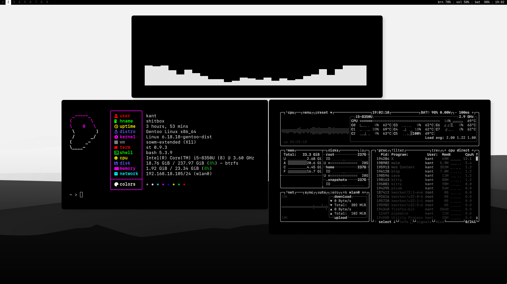

# sowm-extended (*~~Simple~~ Shitty Opinionated Window Manager, now with marginally less suffering*)

<a href="assets/1.png"></a>

A fork of [sowm](https://github.com/dylanaraps/sowm) — an itsy bitsy floating window manager (*~420 sloc*).

- Floating only.
- Fullscreen toggle.
- Window centering.
- Mix of mouse and keyboard workflow.
- Focus with cursor.
- Spawn windows under cursor.
- Partial EWMH support — bars and panels work properly.
- `_NET_WM_WINDOW_TYPE_DOCK` detection — dock windows are unmanaged.
- `_NET_WM_STRUT` / `_NET_WM_STRUT_PARTIAL` — reserved screen edges respected.
- `_NET_CURRENT_DESKTOP` — bars can show which workspace you're on.
- Fastfetch/neofetch WM detection via `_NET_SUPPORTING_WM_CHECK`.
- Alt-Tab window focusing.
- All windows die on exit.
- No window borders.
- [No ICCCM](https://web.archive.org/web/20190617214524/https://raw.githubusercontent.com/kfish/xsel/1a1c5edf0dc129055f7764c666da2dd468df6016/rant.txt).
- etc etc etc

<a href="2.png"></a>

## Default Keybindings

**Window Management**

| combo                       | action                  |
| --------------------------- | ----------------------- |
| `Mouse`                     | focus under cursor      |
| `MOD4` + `Left Mouse`       | move window             |
| `MOD4` + `Right Mouse`      | resize window           |
| `MOD4` + `f`                | maximize toggle         |
| `MOD4` + `c`                | center window           |
| `MOD4` + `w`                | kill window             |
| `MOD4` + `1-9`              | desktop swap            |
| `MOD4` + `Shift` + `1-9`    | send window to desktop  |
| `MOD1` + `TAB` (*alt-tab*)  | focus cycle             |

**Programs**

| combo                    | action           | program         |
| ------------------------ | ---------------- | --------------- |
| `MOD4` + `q`             | terminal         | `st`            |
| `MOD4` + `e`             | file manager     | `kitty -e yazi` |
| `MOD4` + `Return`        | browser          | `firefox-bin`   |
| `MOD4` + `space`         | launcher         | `dmenu_run`     |
| `Print`                  | screenshot       | `maim -s`       |
| `XF86_AudioLowerVolume`  | volume down      | `wpctl`         |
| `XF86_AudioRaiseVolume`  | volume up        | `wpctl`         |
| `XF86_AudioMute`         | volume toggle    | `wpctl`         |
| `XF86_MonBrightnessUp`   | brightness up    | `brightnessctl` |
| `XF86_MonBrightnessDown` | brightness down  | `brightnessctl` |

## Dependencies

- `xlib` (*usually `libX11`*).

## Installation

1. Copy `config.def.h` to `config.h` and modify it to suit your needs.
2. Run `make` to build `sowm`.
3. Copy it to your path or run `make install`.
   - `DESTDIR` and `PREFIX` are supported.

If you are using GDM, save the following to `/usr/share/xsessions/sowm.desktop`. It is still recommended to start `sowm` from `.xinitrc` or through
[your own xinit implementation](https://github.com/dylanaraps/bin/blob/dfd9a9ff4555efb1cc966f8473339f37d13698ba/x).

```
[Desktop Entry]
Name=sowm-extended
Comment=This session runs sowm-extended as desktop manager
Exec=sowm
Type=Application
```

## Thanks

- [sowm](https://github.com/dylanaraps/sowm) — where all of this started
- [2bwm](https://github.com/venam/2bwm)
- [SmallWM](https://github.com/adamnew123456/SmallWM)
- [berry](https://github.com/JLErvin/berry)
- [catwm](https://github.com/pyknite/catwm)
- [dminiwm](https://github.com/moetunes/dminiwm)
- [dwm](https://dwm.suckless.org)
- [monsterwm](https://github.com/c00kiemon5ter/monsterwm)
- [openbox](https://github.com/danakj/openbox)
- [possum-wm](https://github.com/duckinator/possum-wm)
- [swm](https://github.com/dcat/swm)
- [tinywm](http://incise.org/tinywm.html)
